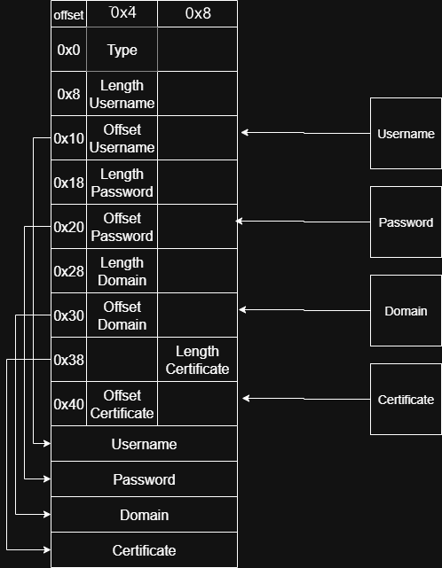
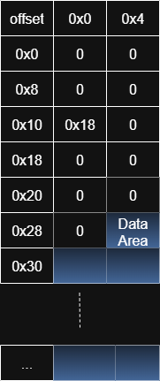

<script>
  import Alert from '$lib/components/extra/alert.svelte'
</script>

Hello reader, this blog post will be about a vulnerability in Windows which was publicly announced last month as part of the  July 8th patch update. The vulnerable component is part of the client authentication mechanism. To begin, let’s take a high-level look at how this component works.

## Client Authentication Architecture

In Windows, the authentication happens in 2 layers, user-mode and kernel-mode.

|***User-mode***|***Kernel-mode***|
----------|------------
|The **Local Security Authority** (LSA/lsass.exe) is a user-mode process that acts as a security policy enforcer. It receives credentials from Winlogon or Credential Provider, packages them and sends them to the appropriate authentication package(e.g Kerberos, NTLM) in kernel-mode. It also ensures that the credential format is correct before passing it down.|In kernel, credentials are validated by the Kerberos, NTLM or other authentication providers. The actual validation (e.g. ticket generation, password hashing) is done here. |


The **CredSSP** protocol is part of this authentication architecture and allows applications to securely delegate user credentials from a client to a server for remote authentication.
For example, RDP protocol uses **CredSSP** protocol for preparing the client-supplied credentials when authenticating to a server, as seen in the image below (first stage). This aspect of the authentication flow will be important when discussing the vulnerability details.


## Root Cause

According to [Microsoft update website](https://msrc.microsoft.com/update-guide/vulnerability/CVE-2025-47987​), the vulnerability results from a chain of 2 bugs:
    - Integer overflow
    - Heap-based buffer overflow

Microsoft also mentions that the weakness resides in a component which is part of the CredSSP protocol. Through patch diffing technique, an interesting finding was observed in the `tspkg.dll` driver. The full module name is **Terminal Services Security Package** and it implements the **TS(Terminal Services)** authentication protocol, which is used for RDP authentication.
This driver is a suitable candidate for this CVE because it is used to prepare the RDP credentials before sending them to the server.

<Alert style="font-size: 20px;" status="info" description="Usually, a faster route to identify the vulnerable driver is by extracting the drivers associated with the patch update (KB number), but recently, Microsoft changed the update file format and the extraction of its associated system files became harder." title="Tip"/>

This is the interesting function:

```c {26-33}
int64_t __fastcall TSCreateKerbCertLogonBuffer(
    UNICODE_STRING *password,
    UNICODE_STRING *domain,
    UNICODE_STRING *username,
    unsigned char *a4,
    size_t certLen,
    unsigned char **a6,
    unsigned int *a7)
{
    unsigned int totalLength;
    unsigned int alignedTotalLength;
    unsigned int __totalLength;
    unsigned int _Size;
    size_t _totalLength;
    ... // other variables declaration

    // Initial setup
    src = a4;
    totalLength = (domain->Length + password->Length + username->Length + 93) & 0xFFFFFFF8;
    _totalLength = totalLength;

    ...

    _Size = certLen;

    // Feature flag check
    if (isEnabled)
    {
        status = RtlULongAdd(totalLength, certLen, (unsigned int *)&_totalLength);
        if (status < 0)
            return (unsigned int)status;

        __totalLength = (unsigned int)_totalLength;
    }
    else
    {
        __totalLength = totalLength + certLen;
    }

    // Allocate memory for the buffer
    buff = TSAllocate(__totalLength);
    _buff = buff;

    if (!buff)
        return 0xC000009A;   // STATUS_INSUFFICIENT_RESOURCES

    // Fill in header
    *(DWORD *)buff = 13;

    currentPtr   = buff + 80;
    passwordBuf  = (void *)(buff + 80);

    // Password
    *(WORD *)(buff + 40) = password->Length;
    length = password->Length;
    *(QWORD *)(_buff + 48) = 80LL;
    *(WORD *)(_buff + 42) = length + 2;
    memcpy_0(passwordBuf, password->Buffer, password->Length);

    // Domain
    domainBuf = (char *)(*(unsigned short *)(_buff + 42) + currentPtr);
    *(WORD *)(_buff + 8) = domain->Length;
    *(WORD *)(_buff + 10) = domain->Length + 2;
    *(QWORD *)(_buff + 16) = &domainBuf[-_buff];
    memcpy_0(domainBuf, domain->Buffer, domain->Length);

    // Username
    usernameBuf = &domainBuf[*(unsigned short *)(_buff + 10)];
    *(WORD *)(_buff + 24) = username->Length;
    *(WORD *)(_buff + 26) = username->Length + 2;
    *(QWORD *)(_buff + 32) = &usernameBuf[-_buff];
    memcpy_0(usernameBuf, username->Buffer, username->Length);

    // Certificate
    certBuf = (char *)(
        (unsigned int64_t)&usernameBuf[*(unsigned short *)(_buff + 26) + 7]
        & 0xFFFFFFFFFFFFFFF8ULL
    );
    *(DWORD *)(_buff + 60) = _Size;
    *(QWORD *)(_buff + 64) = &certBuf[-_buff];
    memcpy_0(certBuf, src, _Size);

    // Output
    ...

    return status;
}
```

The highlighted section shows the patched code. The use of the `RtlULongAdd` function strongly suggests that the original, vulnerable version was susceptible to integer overflow. Later in the function, the result of this calculation, potentially overflowed, is used to allocate a heap object and perform copy operations, which could lead to buffer overflow. It is safe to assume that this is the vulnerable function since it matches the MS description for CVE-2025-47987.

## Building a PoC Crash

In order to identify the entry point into the `tspkg.dll` driver, a good approach is to start from the vulnerable function and trace back the function from which it was called. Then, repeat the same step up until the entry function is reached inside the driver. This is the list of functions which are the most relevant for the vulnerability:

- `SpAcquireCredentialsHandle`
    - `TSCaptureSuppliedCreds`
    - `TSUnpackKerbCertLogonBuffer`
        - `TSInitCertCreds`
            - `TSGetCspDetailFromCspData`
                - `TSRelocateCspString`
            - **TSCreateKerbCertLogonBuffer**

When the PoC binary calls the `AcquireCredentialsHandle` WinAPI function, the SSPI module forwards the request to the `lsass.exe` process. `lsass.exe` then routes the request to the appropriate security package driver—in this case, `tspkg.dll`—where the `SpAcquireCredentialsHandle` function is invoked. The credential flow for a RDP connection where `tspkg.dll` is invoked can be seen in the image below.

```bash
RDP Client
    |
    v
Terminal Services Service (calls SSPI with "TSSSP")
    |
    v
SSPI "TSSSP" package (user mode)
    |
    v
Communicates with LSASS process
    |
    v
LSASS dispatches to LSA package "tspkg.dll" (SpAcquireCredentialsHandle)
    |
    v
`tspkg.dll` handles credentials inside LSASS (SYSTEM)
    |
    v
RDP session proceeds
```
The Poc binary calls `AcquireCredentialsHandle` with the following parameters:
```c
AcquireCredentialHandleW(
    NULL,
    (LPWSTR)L"TSSSP",   // pszPackage (name of the security package)
    SECPKG_CRED_OUTBOUND,
    NULL,
    buf,                // pAuthData (pointer to authentication data)
    NULL,
    NULL,
    &credHandle,
    &expiry
);
```

### Reaching TSInitCertCreds()

Inside `tspkg.dll`, `SpAcquireCredentialsHandle` function will call `TSCaptureSuppliedCreds` without any restrictions for the user-supplied buffer. When trying to reach `TSInitCertCreds`, there are some validations to ensure that the credential buffer received follows a required format.

```c {36-46} {66-74}
int64_t __fastcall TSCaptureSuppliedCreds(
    LUID *a1,
    void *a2,
    TS_PRIMARY_CREDENTIAL **a3,
    unsigned int *a4)
{
    ... // Variables definition

    // Get LSA call info
    ((void (__fastcall *)(char *))TSGlobalLsaFunctions->GetCallInfo)(v30);
    v9 = v30[8];
    *a3 = 0;

    ...

    // Copy logon type
    status = ((int64_t (__fastcall *)(QWORD, int64_t, int *, void *))
            TSGlobalLsaFunctions->CopyFromClientBuffer)(
                0LL, 4LL, &_type, v8);
    ... // Exit on error

    type = _type;

    ...

    v12 = v9 & 0x40;

    // Handle logon types
    if (type == 2)
    {
        // Unpack kerberos password logon buffer
        ...
    }
    else if (type == 0xD)
    {
        // Unpack kerberos certificate logon buffer
        v16 = TSUnpackKerbCertLogonBuffer(
            v12 != 0,
            (char *)v8,
            &username,
            &domain,
            &password,
            &certData,
            &certLen,
            &v22,
            &v34);

        _certData = certData;
        ... // Cleanup on error
        _certLen = certLen;
        goto LABEL_14;
    }
    else
    {
        // Unpack auth ID logon buffer
        ...

LABEL_14:
    // Decode password secret if available
    ...

LABEL_19:
    ... // Certificate check in Certificate Store (not relevant)

    if (pCertContext || _certLen)
    {
        status = TSInitCertCreds(
            pCertContext,
            &username,
            &password,
            &domain,
            _certData,
            _certLen,
            a3);

LABEL_30:
        .. // Cleanup
        goto LABEL_32;
    }

    ...

LABEL_32:
    // Cleanup on failure
    ...

    return status;
}
```
In the second highlighted section, the code calls `TsInitCertCreds`. To reach this call, one of two conditions must be met:

    - A valid certificate is found in the Microsoft certificate store for the specified user, **or**
    - Custom certificate data is provided in the **pAuthData user buffer**.

The latter approach offers greater flexibility, but the custom data must first pass the validations enforced by `TSUnpackKerbCertLogonBuffer` before the `certData` and `certLen` variables are populated.

#### Crafting a valid packed KerbCertLogonBuffer

`TSUnpackKerbCertLogonBuffer` function is responsible for validating the structure of the logon buffer. Primarly, it expects 3 `UNICODE_STRING` structures as input, denoted by **username**, **domain name** and **password**, and 2 output arguments for the certificate data (buffer pointer and its size).

```c {31-34} {48-52} {59-63} {70-74} {76-86 }
int64_t __fastcall TSUnpackKerbCertLogonBuffer(
        int a1,
        char *buffer,
        UNICODE_STRING *__username,
        UNICODE_STRING *__domain,
        UNICODE_STRING *__password,
        unsigned char **cert,
        unsigned int *certSize,
        void **a8,
        unsigned int *a9)
{
  ... // Variables declaration and initialization

  if ( a1 )
  {
    ...
  }
  else
  {
    status = ((int64_t (__fastcall *)(QWORD, int64_t, int *, char *))TSGlobalLsaFunctions->CopyFromClientBuffer)(
            0LL,
            72LL,
            &v31,
            buffer);
    if ( status < 0 )
      return status;
    v14 = cert_len;
    domainLen = domain.Length;
    passwordLen = password.Length;
    usernameLen = username.Length;
  }
  if ( (username.Length & 1) != 0 || (domain.Length & 1) != 0 || (password.Length & 1) != 0 )// check unicode length
  {
    return 0xC000000D;
  }
  else
  {
    v18 = v14 + ((domainLen + passwordLen + usernameLen + 7) & 0xFFFFFFF8);
    if ( v18 < v14 )
    {
      return 0xC0000095;
    }
    else
    {
      v19 = v14 + ((domainLen + passwordLen + usernameLen + 7) & 0xFFFFFFF8);
      copy_username_buf = (char *)TSAllocate(v18);
      if ( copy_username_buf )
      {
        status = ((int64_t (__fastcall *)(QWORD, QWORD, char *, char *))TSGlobalLsaFunctions->CopyFromClientBuffer)(
                0LL,
                username.Length,
                copy_username_buf,
                &buffer[username.Buffer]);
        v21 = v19;
        if ( status < 0 )
          goto LABEL_17;
        username.MaximumLength = username.Length;
        copy_password_buf = &copy_username_buf[username.Length];
        username.Buffer = (UINT64)copy_username_buf;
        status = ((int64_t (__fastcall *)(QWORD, QWORD, char *, char *))TSGlobalLsaFunctions->CopyFromClientBuffer)(
                0LL,
                password.Length,
                copy_password_buf,
                &buffer[password.Buffer]);
        v21 = v19;
        if ( status < 0 )
          goto LABEL_17;
        password.Buffer = (UINT64)copy_password_buf;
        copy_domain_buf = &copy_password_buf[password.Length];
        password.MaximumLength = password.Length;
        status = ((int64_t (__fastcall *)(QWORD, QWORD, char *, char *))TSGlobalLsaFunctions->CopyFromClientBuffer)(
                0LL,
                domain.Length,
                copy_domain_buf,
                &buffer[domain.Buffer]);
        v21 = v19;
        if ( status < 0
          || (domain.MaximumLength = domain.Length,
              domain.Buffer = (UINT64)copy_domain_buf,
              copy_cert_buf = (unsigned int64_t)&copy_domain_buf[domain.Length + 7] & 0xFFFFFFFFFFFFFFF8uLL,
              status = ((int64_t (__fastcall *)(QWORD, QWORD, unsigned int64_t, char *))TSGlobalLsaFunctions->CopyFromClientBuffer)(
                      0LL,
                      cert_len,
                      copy_cert_buf,
                      &buffer[cert_offset]),
              v21 = v19,
              v13 < 0) )
        {
LABEL_17:
          ... // Cleanup
        }
        else
        {
          ... // Variable assignments
        }
      }
      else
      {
        return 0xC000009A;
      }
    }
  }
  return status;
}
```

The **Unicode string check** ensures that the buffers' data must contain an even number of bytes. Subsequent calls to the `CopyFromClientBuffer` LSA function will copy data from a Unicode structure buffer at a specific offset within the `pAuthData` buffer. This operation overwrites the original offset with a pointer to a buffer that contains the copied data. Overall, the logon buffer format should look like this:



### Reaching the vulnerable function

Now, that a valid buffer is constructed, `TsInitCertCred` is called, and a new set of validations is performed.

```c {19-19} {37-44}
int64_t __fastcall TSInitCertCreds(
        PCCERT_CONTEXT pCert,
        UNICODE_STRING *username,
        UNICODE_STRING *password,
        UNICODE_STRING *domain,
        unsigned int *certData,
        unsigned int certLen,
        TS_PRIMARY_CREDENTIAL **a7)
{
  unsigned int _certLen;
  size_t __certLen;
  ... // Other variables declaration

  status = TSGlobalLsaFunctions->ImpersonateClient();
  if ( status >= 0 )
  {
    v12 = (char *)TSAllocate(0xE8uLL);
    ...
    v14 = certData;
    if ( certData && (_certLen = certLen) != 0 )
    {
      status = TSGetCspDetailFromCspData(certLen, certData, (TS_CSPDATA_DETAIL *)(v12 + 0x50));
      ... // Cleanup on error
    }

    ...

    status = TSDuplicateStringEx((UNICODE_STRING *)(v13 + 24), username, v16);
    if ( status >= 0 )
    {
      status = TSDuplicateStringEx((UNICODE_STRING *)(v13 + 8), domain, v19);
      if ( status >= 0 )
      {
        status = TSDuplicatePassword((UNICODE_STRING *)(v13 + 40), password);
        if ( status >= 0 )
        {
          LODWORD(__certLen) = _certLen;
          status = TSCreateKerbCertLogonBuffer(
                     (UNICODE_STRING *)(v13 + 40),
                     (UNICODE_STRING *)(v13 + 8),
                     (UNICODE_STRING *)(v13 + 24),
                     v14,
                     __certLen,
                     (unsigned char **)v13 + 19,
                     (unsigned int *)v13 + 40);
          ... // Cleanup on error
        }
      }
    }
    goto LABEL_7;
  }
LABEL_9:
  ... // Cleanup
  return status;
}
```

These validations ensure that the certificate data adheres to the Windows-specific certificate format known as **CSP (Cryptographic Service Provider)**. This format is composed of two parts: a **header** and a **body**(CSP data). In this context, **CSP data** refers to the information within the certificate that identifies and links it to its corresponding private key provider.

#### Crafting a valid CSP buffer

The `TSGetCspDetailFromCspData` function first verifies that the CSP buffer is at least 0x30 bytes in size, 0x28 bytes for the header(10 DWORDs) + 1 padding DWORD + 1 **Data Area** DWORD.

```c
int64_t __fastcall TSGetCspDetailFromCspData(
        unsigned int certLen,
        unsigned char *certData,
        TS_CSPDATA_DETAIL *a3)
{
  ... // Variables declaration

  if ( !certData || certLen < 0x30 || !a3 )
    return 0xC000000DLL;
  memset_0(a3, 0, 0x48uLL);
  status = TSRelocateCspString(*((DWORD *)certData + 6), (char *)certData, certLen, &v13, 1);
  if ( status >= 0 )
  {
    status = TSRelocateCspString(*((DWORD *)certData + 7), (char *)certData, certLen, &v10, 1);
    if ( status >= 0 )
    {
      status = TSRelocateCspString(*((DWORD *)certData + 8), (char *)certData, certLen, &v11, 0);
      if ( status >= 0 )
      {
        _status = TSRelocateCspString(*((DWORD *)certData + 9), (char *)certData, certLen, &v12, 0);
        v3 = v12;
        status = _status;
        if ( _status >= 0 )
          status = TSBuildCspDetail(v13, v10, v11, v12, *((DWORD *)certData + 5), a3);
      }
    }
  }
  ... // Cleanup
  return status;
}
```

After this initial check, the function delegates further validation to `TSRelocateCspString`. This includes:
    - Checking the **providerName** value (located at **header[5]**).
    - Validating the offset from which the string starts within the **Data Area** (located at **header[6]**).

```c
int64_t __fastcall TSRelocateCspString(
        int a1,               // Offset into the input buffer
        char *a2,             // Pointer to a buffer (CSP blob)
        unsigned int a3,      // Total size of that buffer
        unsigned short **a4,  // [out] Receives pointer to newly allocated wide string
        int a5)               // Flag
{
  ... // Variables declaration

  v5 = 0;
  if ( !a4 || !a2 || a3 < 0x30 )
    return 0xC000000DLL;
  *a4 = 0LL;
  if ( !a1 && a5 )
    return 0LL;
  v8 = 2 * a1;    // Offset in bytes
  v9 = a2 + 40;   // Data/String area
  v10 = a3 - 40;
  if ( v8 >= v10 )
    return 0xC000000DLL;
  v11 = &v9[v8];
  v12 = &v9[v10];
  v13 = v11;
  if ( v11 >= v12 )
    return 0xC000000DLL;
  while ( 1 )
  {
    v14 = *v13;
    v5 += 2;
    v15 = v13 + 1;
    if ( !v14 && v15 < v12 && !*v15 )
      break;   // Found double-null terminator => End of wide string
    v13 = v15 + 1;
    if ( v13 >= v12 )
      return 0xC000000DLL;
  }
  v16 = v5;
  v17 = (unsigned short *)TSAllocate(v5);
  v18 = v17;
  if ( v17 )
  {
    memcpy_0(v17, v11, v16);
    *a4 = v18;
    return 0LL;
  }
  return 0xC000009A;
}
```

**Note**: There are no restrictions on the length of the **Data Area** section!



### Triggering the bug

The buffer format is finalized and passed to the vulnerable function `TSCreateKerbCertLogonBuffer`.

```c {14-16} {18-20} {58-58}
int64_t __fastcall TSCreateKerbCertLogonBuffer(
    struct UNICODE_STRING *password,
    struct UNICODE_STRING *domain,
    struct UNICODE_STRING *username,
    unsigned char *certData,
    size_t certLen,
    unsigned char **a6,
    unsigned int *a7)
{
    unsigned int totalLength;
    unsigned int __totalLength;
    unsigned int _Size;
    ... // Other variables declaration

    // Calculate total length (aligned)
    totalLength = (domain->Length + password->Length + username->Length + 93) & 0xFFFFFFF8;
    __totalLength = totalLength + certLen;
    _Size = certLen;

    // Allocate memory
    vulnBuf = TSAllocate(__totalLength);
    _vulnBuf = vulnBuf;
    if (!vulnBuf)
        return 0xC000009A;   // STATUS_INSUFFICIENT_RESOURCES

    // Fill in header
    *(DWORD *)vulnBuf = 13;
    currentPtr   = vulnBuf + 80;
    passwordBuf  = (void *)(vulnBuf + 80);

    // Password
    *(WORD *)(vulnBuf + 40) = password->Length;
    length = password->Length;
    *(QWORD *)(_vulnBuf + 48) = 80LL;
    *(WORD *)(_vulnBuf + 42) = length + 2;
    memcpy_0(passwordBuf, password->Buffer, password->Length);

    // Domain
    domainBuf = (char *)(*(unsigned short *)(_vulnBuf + 42) + currentPtr);
    *(WORD *)(_vulnBuf + 8) = domain->Length;
    *(WORD *)(_vulnBuf + 10) = domain->Length + 2;
    *(QWORD *)(_vulnBuf + 16) = &domainBuf[-_vulnBuf];
    memcpy_0(domainBuf, domain->Buffer, domain->Length);

    // Username
    usernameBuf = &domainBuf[*(unsigned short *)(_vulnBuf + 10)];
    *(WORD *)(_vulnBuf + 24) = username->Length;
    *(WORD *)(_vulnBuf + 26) = username->Length + 2;
    *(QWORD *)(_vulnBuf + 32) = &usernameBuf[-_vulnBuf];
    memcpy_0(usernameBuf, username->Buffer, username->Length);

    // Certificate
    certBuf = (char *)(
        (uint64_t)&usernameBuf[*(unsigned short *)(_vulnBuf + 26) + 7]
        & 0xFFFFFFFFFFFFFFF8ULL
    );
    *(DWORD *)(_vulnBuf + 60) = _Size;
    *(QWORD *)(_vulnBuf + 64) = &certBuf[-_vulnBuf];
    memcpy_0(certBuf, certData, _Size); // Overflow occurs here
    ...

    return status;
}
```

The heap object size is calculated as the sum of the lengths of the **username**, **domain**, **password**, and **certificate**, plus a fixed overhead of **93 bytes**. Because the certificate length can be any 32-bit (DWORD) value, the total size calculation can overflow.

The resulting incorrect size is then used to allocate a heap object. When the code later copies the certificate bytes into this undersized buffer, an overflow occurs—approximately 4 GB of data is written past the end of the allocated chunk.


This overwrites adjacent heap structures and accesses unmapped memory, leading to a crash of the privileged `lsass.exe` process.

[PoC code here (Win11 23H2)](https://github.com/Kryptoenix/CVE-2025-47987_PoC/)

<video controls src="poc.mp4" title="Title"></video>

## Exploitation Ideas

Even though Microsoft classifies this CVE with an exploitability assessment of ***“Exploitation More Likely”***, the crash caused by the overflow appears difficult to avoid because of the large number of bytes involved. It is theoretically possible that pointers could be overwritten before integrity checks are triggered, which might open a path to code execution that causes persistence across the forced reboot. However, modern security mitigations significantly reduce the likelihood of such a scenario. Therefore, the exploitation stage requires a better expertise in:
- Windows heap internals
    - LFH, safe unlinking & pointer decoding, guard pages, delayed free

- Mitigations in user-mode on Windows 11
    - Heap isolation, pointer encoding, CFG, CET, MemGC

## Conclusion

This concludes my analysis. Each piece of the puzzle has helped build a clearer picture of the vulnerability.  Hopefully, this sparks someone’s curiosity to dig deeper and perhaps even solve the exploitation mystery by crafting a working LPE proof-of-concept:). Either way, remember to stay curious and vigilant. Until next time — crash `lsass.exe`!

## References

https://msrc.microsoft.com/update-guide/vulnerability/CVE-2025-47987

https://ldapwiki.com/wiki/Wiki.jsp?page=Windows%20Client%20Authentication%20Architecture

https://learn.microsoft.com/en-us/windows/win32/secauthn/acquirecredentialshandle--general
